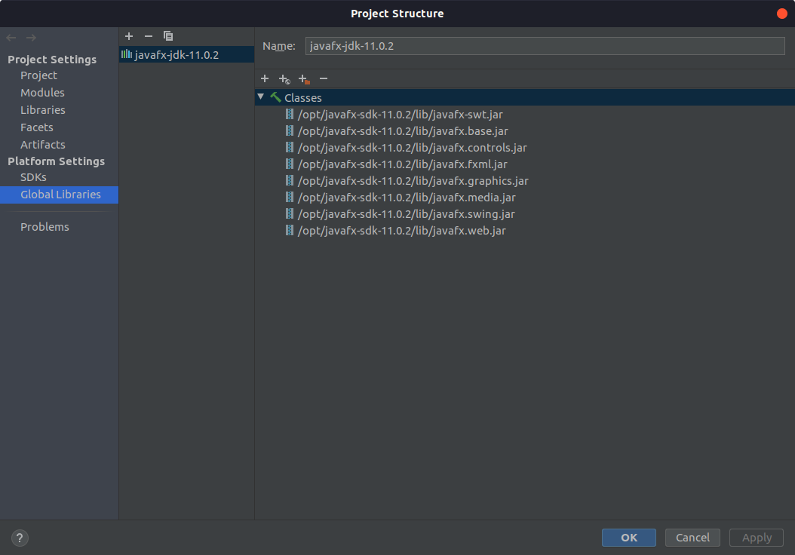

# Tic Tac Toe Game

Gra zawiera dynamicznie tworzony widok z polami.
Dostępne są poziomy:

- EASY (3x3)
- MEDIUM (4x4)
- HARD (5x5)

## URUCHOMIENIE PROJEKTU
+ W projekcie użyto Java w wersji 11: **OpenJDK 11.0.4**

+ W związku z użyciem JavaFX konieczne jest pobranie **javafx-jdk-11.0.2** i dodanie do globalnych zmiennych projektu jak to przedstawiono poniżej:

+ W drzewie projektu należy oznaczyć katalog ~/ticTacToeGame/src jako **SourceRoot**

+ Plik module-info.java który znajduje się w katalogu ~/ticTacToeGame/src jest konieczny do uruchomienia aplikacji, **nie należy go usuwać**

      module ticTacToeGame {
           requires javafx.fxml;
           requires javafx.controls;
           requires javafx.graphics;
           opens ticTacToe;
       }

## OPIS GRY
+ Gra tworzy obiekty użytkownika i komputer automatycznie przy inicjalizacji FXML'a.  
+ Start rozgrywki następuję po wybraniu przycisku **START_GAME**.  
+ Użytkownik poprzez wciśnięcie prawego przycisku myszki w wybranym polu podświetla okrąg.  
+ Wybierając lewy przycisk myszki użytkownik może odznaczyć wybrane pole.  
+ Przycisk **RESET_MOVE** ma na celu umożliwienie wykonania kolejnego ruchu w miejsce cofniętego.  
+ Potwierdzenie ruchu możliwe jest poprzez wybranie przycisku **CONFIRM_MOVE** przez co komputer wykonuje swój ruch.
+ By wykonać kolejny ruch należy wybrać **MAKE_MOVE** ponownie.
+ W zależności od wybranego poziomu w celu osiągnięcia wygranej należy zaznaczyć poziomo, pionowo lub po skosie, odpowiednią liczbę okręgów:

| EASY | MEDIUM | HARD |
|:----:|:------:|:----:|
|   3  |   4    |   5  |

+ Wynik rozgrywki jest wyświetlany w opisie przycisku w górnym menu. Jego kliknięcie lewym przyciskiem myszki resetuje rozgrywkę.
 
 
